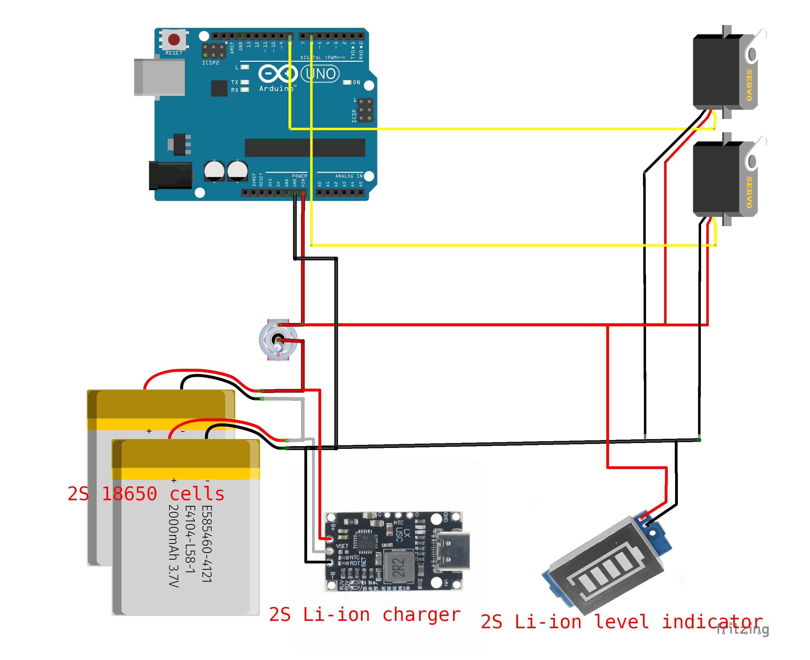

# Assembly instructions for Sun Engraver Mark1

## Wiring



## Bill of materials

| Name                        | Count |
|-----------------------------|-------|
| M2 Nut                      | 2     |
| M2.5 Nut                    | 8     |
| M3 Nut                      | 10    |
| M5 Nut                      | 1     |
| M2x10 Bolt                  | 2     |
| M2.5x8 Bolt                 | 10    |
| M3x5 Phillips Head Bolt     | 4     |
| M3x12 Phillips Head Bolt    | 2     |
| M3x10 Phillips Head Bolt    | 4     |
| M3x10 Socket Head Cap Screw | 4     |
| M3x16 Socket Head Cap Screw | 4     |
| M3x18 Socket Head Cap Screw | 11     |
| M3 Heat Inserts (short)     | 4     |
| 4x9x4mm Ball Bearing        | 2     |
| 60mm diam bare glass lens, 185mm foces distance | 1 |
| Servo E-power Digital DC5535 or same size like MG996R | 2 |
| Arduino UNO                 | 1     |
| Waveshare 320x240 2.8inch Touch LCD Shield | 1 |
| USB-C 2S Li-Ion charger     | 1     |
| 18650 Li-ion Battery        | 2     |
| 2x18650 Battery holder      | 1     |
| Toggle switch               | 1     |
| Li-ion 2S charge level indicator | 1 |
| Photo thread adapter 3/8" -> 1/4" | 1 |
| GoPro M5 mount screw         | 1     |
| Small but sturdy tripod      | 1     |

## 3D Printed parts assembly

All the models to print can be found at https://www.printables.com/model/1385516-portable-sun-engraver

Do not print in PLA, device is only used in the direct sun lights, and PLA heats up enough to loose the form.
I used PETG without any issues.

The only piece that needs support is "Screen top section.stl". Should be printed with top face down for the best surface, and use support for recesses.

Srew the bracket to a second servo case (which does not have GoPro mount). Note the holes size the bracket, only one orientation is correct!


Insert servo into the case, carefully guide wires out of the hole and through wire channel:


Put top cover, the one with 2 holes on the side (other ones don't have 2 holes), screw it in with nuts and bolts:


Put the first servo (into case with GoPro mount) in as well, also put and screw in top cover:


Press fit bearing to the first servo case:


Press fit bearing to the second servo case:


Put the bracket of the second servo over the servo axle and bearing of the first servo. It'll require to bend it a lot, but if you print with PETG and enough temperature, should be fine. Make sure there is an air gap between the bracket and the surfaces of servo case, so it is not rubbing on them.

Note! For easier adjustment later, move servo to 90 degree position using servo tester or simple arduino circuit.


Clamp down the servo axle inside the bracket. Note that you may need to loosen it later when you'll calibrate servo angles


Clamp down the bearing:


Press fit lens into it's holder, from the bottom. Bottom is where the weird stomp is:


Mount lens pivot axle to the lens holder:


Insert heat inserts of the pivot clamp piece. They can be replaced with usual M3 nuts, but it will be harder to afjust tension


Mount that clamp piece to the new servo bracket. Heat inserts should face the bracket, and be flush within the surface for straight mounting:


Now get the second piece of the clamp and clamp pivot axle with it, using 2 screws:


Put the bracket of the lens onto the second servo the same way, by bending the bracket a lot.

Note! For easier adjustment later, put the servo into 90 degree position as well. Then clamp axle and bearing the same way you did with the first bracket.


Insert heat inserts to the bottom screen section, from the inside:


Now mount the batteries and charger. I used battery holder, and a hot glue gun. Their wiring should be done before mounting.


Mount the servo assembly to the screen bottom section. Carefully guide servo wires through the hole:


Now mount screen middle section with 4 screws, be sure to have all the needed wires out (to toggle switch, to battery level indicator, and to Arduino board (servo signals, raw power in and Ground))


Now mount the Arduino board. I soldered the wires to the board, because dupont pins are used by the screen hat.
Put the screen hat on the Arduino board.


Now mount the toggle switch and the battery level indicator to the screen top section. It may need to cut some corners to get it in. Be prepared to use scalpel or similar sharp tool.
Battery indicator was too bright for my liking, so I put a 2 layer screen in front of it. Model is provided, usage is optional.


Now mount the front panel to the rest of screen assembly. Note that there are 3 long screws, and one short - for the corner with a cutout for switch.


Now you can put stylus into its holder:


The focusing frame is optional, it is used to burn images on plywood pieces. You can use the device without it outdoors, but you'll have to place work piece manually carefully.
Press-fit the M5 nut, and screw in the photo thread adapter:


Now you can mount the device to this focusing frame. Be sure to put the servo flat on the frame surface, it should not tilt at the gopro mount point.


The mechanics is ready! Now burn the code to the arduino board, and proceed with servo calibration.

## Servo calibration

In the code, uncomment the line:

```
#define CALIBRATE_SERVO_ANGLES
```

And look for the lines in the code:

```
servoArm1.writeFloat(ARM1_STRAIGHT_BRACKET_ANGLE);
servoArm2.writeFloat(ARM2_STRAIGHT_BRACKET_ANGLE);
```

When the config is correct, they should rotate servos so the brackets are straight, just like shown in all the pictires above. Tune this using the `config.h` file with these lines:

```
#define ARM1_STRAIGHT_BRACKET_ANGLE 88
#define ARM2_STRAIGHT_BRACKET_ANGLE 90

#define ARM1_MIN_PULSE 500
#define ARM1_MAX_PULSE 2500

#define ARM2_MIN_PULSE 500
#define ARM2_MAX_PULSE 2500
```

The pulses are more important. Because servos (especially cheap ones, that I used) are not always precice, and may need significant pulse widths adjustments. Ideally, when pulse widhts are set correctly, when you do `servoArm1.writeFloat(0);`, bracked is perpendicular to servo body, when you do `servoArm1.writeFloat(90);` it is straight (meaning ARM1_STRAIGHT_BRACKET_ANGLE should be 90), and when you do `servoArm1.writeFloat(180);` it is perpendicular again, on the other side. But often this is not achievable at all, so just making sure that at least `servoArm1.writeFloat(ARM1_STRAIGHT_BRACKET_ANGLE);` puts the bracket straight and that when you move 90 degrees to either side, it becomes perpendicular - is enough.

Servo direction. Servo may tuen to different directions when requested angle increases positivaly. The non inverted servo should turn Counter-Clock-Wise when the requested angle increases. If it's not, like mine, update the IK2DOF constructor invocation:

```
IK2DOF ik2dof(
    70,  // arm1 length
    70,  // arm2 length
    ARM1_STRAIGHT_BRACKET_ANGLE,
    ARM2_STRAIGHT_BRACKET_ANGLE - ARM2_BRACKET_TO_LENS_ANGLE,
    true,  // arm1 inverted
    true,  // arm2 inverted
    servoArm1,
    servoArm2
);
```

Flip both "arm1 inverted" and "arm2 inverted" from true to false, and flip sign before `ARM2_BRACKET_TO_LENS_ANGLE` from "-" to "+".

Play with it, understand what's going on, and you'll calibrate it easy. Just trying to follow instructions (at least these ones) won't always give you the good result here.

## Put images to SD card

SD card must be formatted to FAT32. Smaller sizes, like 1-2 Gb work better here.

Device requires pictures to be *.bmp saved with 24 bit color, no compression, and size should be strictly 100x100 pixels. Put up to 11 pictures, there is no scroll in the file list, and 11 files ought to be enough for anybody.

## Have FUN!

But remember that design files and instructions are provided as is, I won't provide any support not warranty. Also, lens and sun can cause fire, so be sure you have fire extinguisher nearby and use caution when lens is not covered by the protective cap. Never leave device working in the sun unattended, any glitch and it will stop moving the lens, burning the same spot and starting a fire!
