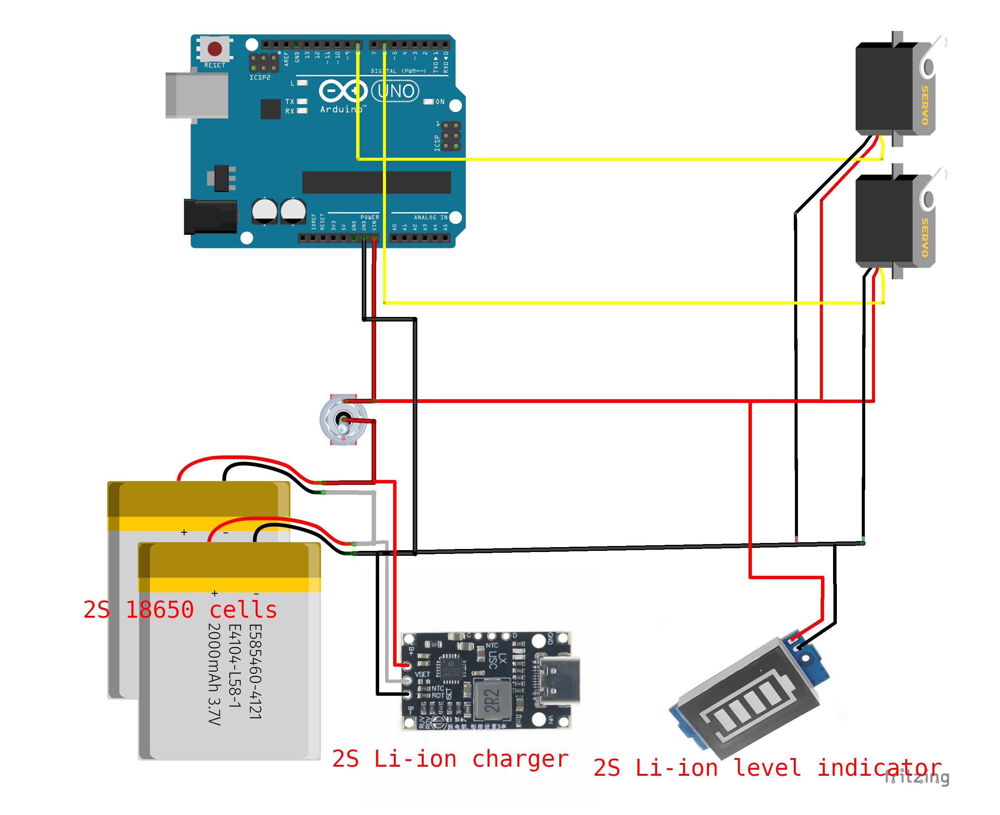

# Sun Engraver Mark1

WARNING!

Lens with sunlight can be a source of FIRE! Do not leave lens uncovered unattended in the sunlight. As well as do not leave the device unattended while it is working, or with open lens when sun can reach it. You are doing everything on your own responsibility and your own risk, take all the necessary care.

## Wiring



## Bill of materials

Servo angular accuracy is the key here! Better digital and with as low deadband as possible.

I used cheap digital ones, E-power Digital DC5535. They are the same size as cheapest MG995/MG996R, have a bit better build quality and less backlash which is important. But the deadband is still not great. Servo cases will fit eitehr DC5535 or MG995 or MG996R.


| Name                        | Count |
|-----------------------------|-------|
| M2 Nut                      | 2     |
| M2.5 Nut                    | 8     |
| M3 Nut                      | 10    |
| M5 Nut                      | 1     |
| M2x10 Bolt                  | 2     |
| M2.5x8 Bolt                 | 10    |
| M3x5 Phillips Head Bolt     | 4     |
| M3x12 Phillips Head Bolt    | 2     |
| M3x10 Phillips Head Bolt    | 4     |
| M3x10 Socket Head Cap Screw | 4     |
| M3x16 Socket Head Cap Screw | 4     |
| M3x18 Socket Head Cap Screw | 11     |
| M3 Heat Inserts (short)     | 4     |
| 4x9x4mm Ball Bearing        | 2     |
| 60mm diam bare glass lens, 185mm foces distance | 1 |
| Servo E-power Digital DC5535 or same size like MG996R | 2 |
| Arduino UNO                 | 1     |
| Waveshare 320x240 2.8inch Touch LCD Shield | 1 |
| USB-C 2S Li-Ion charger     | 1     |
| 18650 Li-ion Battery        | 2     |
| 2x18650 Battery holder      | 1     |
| Toggle switch               | 1     |
| Li-ion 2S charge level indicator | 1 |
| Photo thread adapter 3/8" -> 1/4" | 1 |
| GoPro M5 mount screw         | 1     |
| Small but sturdy tripod      | 1     |

## 3D Printed parts assembly

All the models to print can be found at https://www.printables.com/model/1385516-portable-sun-engraver

Do not print in PLA, device is only used in the direct sunlight, and PLA heats up enough to loose the form.
I used PETG without any issues.

The only piece that needs support is "Screen top section.stl". Should be printed with top face down for the best surface, and use support for recesses.

### Step by step assembly

Srew the bracket to a servo case (which does not have a GoPro mount). Note the holes size of the bracket, only one orientation is correct!


Insert the servo into the case, carefully guide wires out of the hole and through wire channel:


Put the top cover, the one with 2 holes on the side (the other one don't have 2 holes), screw it in with nuts and bolts:


Put the other servo in as well, into the case with a GoPro mount. Also put and screw in top cover:


Press fit bearing to the servo case:


Press fit bearing to the other servo case:


Put the bracket with the servo over the other servo axle and bearing. It'll require to bend the bracket significantly, but if you print with PETG and enough temperature, it should be fine. Make sure there is an air gap between the bracket and the surfaces of servo case, so it is not rubbing on them.

Note! For easier adjustment later, move servo to 90 degree position using servo tester or a simple arduino circuit.


Clamp down the servo axle by the bracket. Note that you may need to loosen it temporary later when you'll be calibrating servo angles.


Clamp down the bearing in a similar way:


Press fit lens into its holder, from the bottom. Bottom is where the weird stomp is:


Mount lens pivot axle to the lens holder:


Insert heat inserts of the pivot clamp piece. They can be replaced with usual M3 nuts, but it will be harder to adjust tension


Mount that clamp piece to the new servo bracket. Heat inserts should face the bracket, and be flush with the surface for straight mounting:


Now get the second piece of the clamp and clamp pivot axle with it, using 2 screws:


Put the bracket of the lens onto the servo the same way, by bending the bracket significantly.

Note! For easier adjustment later, put the servo into 90 degree position as well. Then clamp axle and bearing the same way you did for the first bracket.


Insert heat inserts to the bottom screen section, from the inside:


Now mount the batteries and charger. I used a battery holder and a hot glue gun. The power wiring should be done before mounting.


Mount the servo assembly to the screen bottom section. Carefully guide servo wires through the hole:


Now mount screen middle section with 4 screws, be sure to have all the needed wires out (toggle switch wires, battery level indicator wires, and wires to Arduino board (2 servo signals, a raw power in and a ground))


Now mount the Arduino board. I soldered the wires to the board, because dupont pins are used by the screen hat.
Put the Waveshare 320x240 2.8 inch screen hat onto the Arduino board.


Now mount the toggle switch and the battery level indicator to the screen top section. It may need to cut some corners to get it in, the fit is very tight. Be prepared to use scalpel or similar sharp tool.
Battery indicator was too bright for my liking, so I put a 2 layer screen in front of it. Model is provided but it is optional.


Now mount the front panel to the rest of screen assembly. Note that there are 3 long screws and one short - for the corner with a cutout for switch.


Now you can put stylus into its holder:


The focusing frame is optional, it is used to burn images on plywood pieces. You can use the device without it when outdoors, but you'll have to place work piece manually in the focus plane using the focusing cap.

Press-fit the M5 nut, and screw in the photo thread adapter:


Now you can mount the device to this focusing frame. Be sure to put the servo flat on the frame surface, it should not tilt at the gopro mount point.


The mechanics is ready! Now open the code with VSCode+PlatformIO and proceed with servo calibration.

## Servo calibration

In the code in main.cpp, uncomment the line:

```
#define CALIBRATE_SERVO_ANGLES
```

And look for the lines in the code:

```
servoArm1.writeFloat(ARM1_STRAIGHT_BRACKET_ANGLE);
servoArm2.writeFloat(ARM2_STRAIGHT_BRACKET_ANGLE);
```

When the config is on point, they should rotate servos so the brackets are straight inline with the servo bodies, just like shown in all the pictires above. Tune this using the `config.h` file with these lines:

```
#define ARM1_STRAIGHT_BRACKET_ANGLE 88
#define ARM2_STRAIGHT_BRACKET_ANGLE 90

#define ARM1_MIN_PULSE 500
#define ARM1_MAX_PULSE 2500

#define ARM2_MIN_PULSE 500
#define ARM2_MAX_PULSE 2500
```

The pulse durations are more important. Because servos (especially cheap ones, that I used) are not always precice, and may need significant pulse width adjustments. Ideally:
  - when pulse widhts are set correctly, when you do `servoArm1.writeFloat(0);`, bracket should be perpendicular to the servo body
  - when you do `servoArm1.writeFloat(90);` it should be straight (meaning ARM1_STRAIGHT_BRACKET_ANGLE should be 90)
  - when you do `servoArm1.writeFloat(180);` it is perpendicular again, on the other side
But often this is not achievable at all, so just making sure that at least `servoArm1.writeFloat(ARM1_STRAIGHT_BRACKET_ANGLE);` puts the bracket straight and that when you move 90 degrees to either of sides, it becomes perpendicular - is enough.

Servo direction. Different servo models may turn different directions when commanded angle increases positively. The "normal" servo should turn Counter-Clock-Wise when the requested angle increases. If it's not, like mine, I call it "inverted", and IK2DOF constructor invocation will be:

```
IK2DOF ik2dof(
    70,  // arm1 length
    70,  // arm2 length
    ARM1_STRAIGHT_BRACKET_ANGLE,
    ARM2_STRAIGHT_BRACKET_ANGLE - ARM2_BRACKET_TO_LENS_ANGLE,
    true,  // arm1 inverted
    true,  // arm2 inverted
    servoArm1,
    servoArm2
);
```

If your servos are not inverted (like MG996R), flip both "arm1 inverted" and "arm2 inverted" from true to false, and flip sign before the `ARM2_BRACKET_TO_LENS_ANGLE` from "-" to "+".

Play with it, understand what's going on, and you'll calibrate it easy. Just trying to follow instructions (at least these ones) won't always give you the good result here.

## Put images to SD card

SD card must be formatted to FAT32. Smaller sizes, like 1-2 Gb work better here.

Device requires pictures to be *.bmp saved with 24 bit color, no compression, and size should be strictly 100x100 pixels. Put up to 11 pictures, there is no scroll in the file list, and 11 files ought to be enough for anybody.

## Have FUN!

But remember that design files and instructions are provided as is, I won't provide any support nor warranty. Also, lens and sun can cause fire, so be sure you have a fire extinguisher nearby and use caution when lens is not covered by the protective cap. Never leave device working in the sun unattended, any glitch and it will stop moving the lens, burning the same spot and starting a fire!
